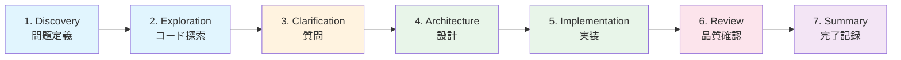
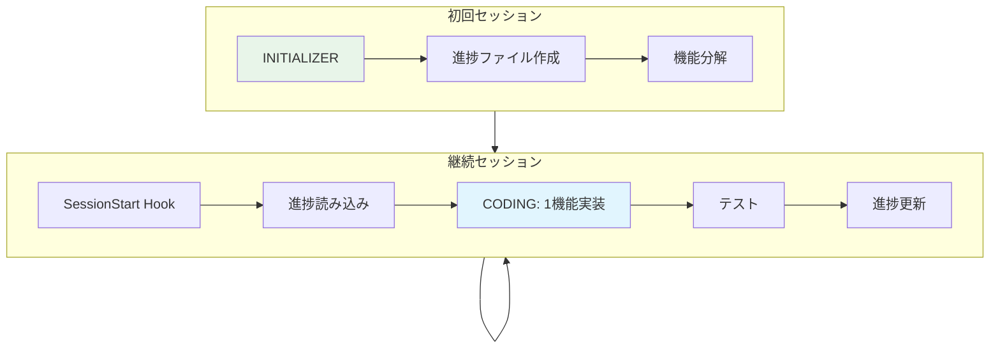
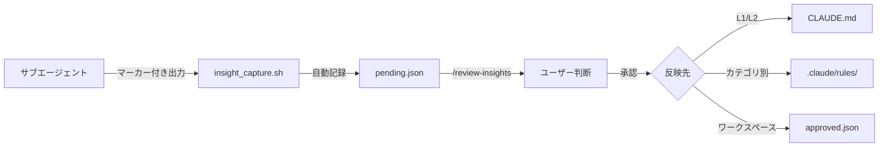
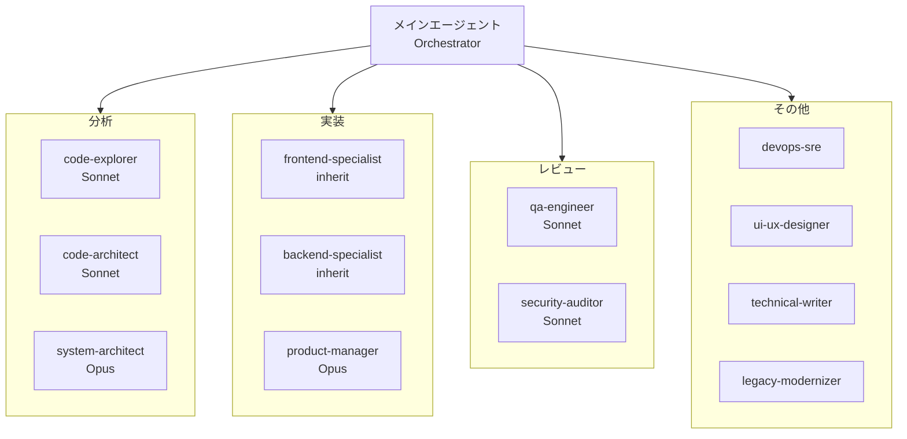

# SDD Toolkit

**Claude Code 向け仕様駆動開発ツールキット**

Anthropic の 6 つの Composable パターンをすべて実装した、長時間自律作業のためのエージェントフレームワーク。

---

## このプラグインの目的

| 目標 | 実現方法 |
|------|----------|
| **長時間の自律作業** | Initializer + Coding パターン、JSON 進捗ファイル、SessionStart フック |
| **徹底したスペック駆動** | 7フェーズワークフロー、No Code Without Spec、`/spec-review` |
| **サブエージェントへの移譲** | 12専門エージェント、コンテキスト保護、結果サマリーのみ返却 |
| **ユーザーへの十分な質問** | Phase 3: Clarifying Questions、AskUserQuestion ツール、信頼度 80% 閾値 |

---

## クイックスタート

### インストール

```bash
# プラグインディレクトリからインストール
/plugin install sdd-toolkit@your-marketplace

# または開発用にローカルロード
claude --plugin-dir /path/to/sdd-toolkit
```

### 基本的な使い方

```bash
# 複雑な機能開発（7フェーズワークフロー）
/sdd ユーザー認証機能を OAuth 対応で実装

# 仕様のレビュー
/spec-review docs/specs/user-auth.md

# コードレビュー（並列エージェント、信頼度 >= 80）
/code-review staged

# 小規模タスクの高速実装
/quick-impl README のタイポを修正

# 新規プロジェクトのスタック相談・構築
/stack-consult

# セッション再開（進捗ファイルから）
/resume

# 体系的デバッグ
/debug エラーメッセージをここに
```

---

## コマンド一覧

| コマンド | 用途 | 使用場面 |
|----------|------|----------|
| `/sdd` | 7フェーズワークフロー | 新機能、複雑な変更 |
| `/spec-review` | 仕様検証 | 実装前の仕様確認 |
| `/code-review` | コードレビュー | コミット前（並列エージェント） |
| `/review-response` | レビュー対応 | PRレビューコメントへの対応 |
| `/review-insights` | 知見レビュー | 蓄積された知見を評価・反映 |
| `/quick-impl` | 高速実装 | 明確な小規模タスク |
| `/project-setup` | ルール生成 | プロジェクト固有ルールの自動生成 |
| `/stack-consult` | スタック相談 | 新規プロジェクトの技術選定・構築 |
| `/resume` | セッション再開 | 進捗ファイルから作業を再開 |
| `/debug` | 体系的デバッグ | エラー分析・根本原因特定・修正 |
| `/merge-conflict` | コンフリクト解決 | マージコンフリクトの体系的解決 |
| `/doc-audit` | ドキュメント監査 | コードとドキュメントの整合性検証 |
| `/ci-fix` | CI失敗対応 | CI/CDパイプライン失敗の診断・修正 |
| `/hotfix` | 緊急修正 | 本番障害の迅速な対応 |

---

## 7フェーズ SDD ワークフロー

`/sdd` コマンドは包括的な開発ワークフローを実行します:



| フェーズ | 目的 | 実行内容 |
|----------|------|----------|
| 1. Discovery | 構築内容の理解 | 問題定義、制約特定、ユーザー確認 |
| 2. Codebase Exploration | 既存コードの把握 | 2-3 の `code-explorer` エージェントを並列実行 |
| 3. Clarifying Questions | 曖昧さの解消 | エッジケース、エラー処理、統合ポイントを確認 |
| 4. Architecture Design | 設計決定 | 2-3 の `code-architect` エージェントで分析し、統合推奨 |
| 5. Implementation | 機能構築 | 専門エージェントに移譲、1 機能ずつ実装 |
| 6. Quality Review | 品質確保 | qa-engineer、security-auditor、code-explorer を並列実行 |
| 7. Summary | 完了記録 | 変更内容、決定事項、次のステップを文書化 |

---

## 長時間作業サポート

[Effective Harnesses for Long-Running Agents](https://www.anthropic.com/engineering/effective-harnesses-for-long-running-agents) に基づく設計:



| ロール | タイミング | 実行内容 |
|--------|------------|----------|
| **INITIALIZER** | 初回セッション | 進捗ファイル作成、機能分解、状態初期化 |
| **CODING** | 各セッション | 進捗読み込み、1 機能実装、テスト、進捗更新 |

### 進捗ファイル

```
.claude/workspaces/
└── {workspace-id}/           # 形式: {branch}_{path-hash} 例: main_a1b2c3d4
    ├── claude-progress.json  # 進捗ログと再開コンテキスト
    ├── feature-list.json     # 機能/タスクのステータス追跡
    ├── insights/             # 知見追跡（自動キャプチャ）
    │   ├── pending.json      # 未評価の知見
    │   └── approved.json     # 承認済み（ワークスペース固有）
    └── logs/
        ├── subagent_activity.log
        └── sessions/
```

**ワークスペース ID**: Git ブランチ名とパスのハッシュで構成。Git worktree ごとに分離され、複数プロジェクトの同時実行をサポート。

> **なぜ JSON か？** 「モデルは Markdown ファイルと比較して JSON ファイルを不適切に変更する可能性が低い」- Anthropic

### 知見追跡（Insight Tracking）

開発中の発見や学習を自動的にキャプチャし、評価・反映するシステム:



**知見マーカー**: サブエージェントが重要な発見をした際に出力

| マーカー | 用途 |
|----------|------|
| `INSIGHT:` | 一般的な学習や発見 |
| `LEARNED:` | 経験から学んだこと |
| `DECISION:` | 重要な決定とその理由 |
| `PATTERN:` | 再利用可能なパターン |
| `ANTIPATTERN:` | 避けるべきアプローチ |

**使い方**:

```bash
# セッション開始時に通知される未評価の知見を確認
/review-insights

# 特定のワークスペースの知見を確認
/review-insights feature-auth_a1b2c3d4

# 全ワークスペースの未評価知見を一覧
/review-insights list
```

**設計原則**:
- **自動記録**: サブエージェント完了時にマーカー付き出力を自動キャプチャ
- **ユーザー主導の評価**: 各知見を一つずつインタラクティブに評価
- **段階的反映**: ワークスペース固有 → `.claude/rules/` → CLAUDE.md

---

## エージェント一覧



| カテゴリ | エージェント | 用途 |
|----------|--------------|------|
| **分析** | `code-explorer` | 深いコードベース分析（読み取り専用） |
| | `code-architect` | 機能設計ブループリント |
| | `system-architect` | システムレベル設計、ADR（Opus） |
| **実装** | `frontend-specialist` | UI 実装 |
| | `backend-specialist` | API 実装 |
| | `product-manager` | 要件収集、PRD 作成（Opus） |
| **レビュー** | `qa-engineer` | テスト戦略、カバレッジ分析 |
| | `security-auditor` | OWASP Top 10、脆弱性レビュー |
| **その他** | `devops-sre` | インフラ、CI/CD |
| | `ui-ux-designer` | デザインシステム |
| | `technical-writer` | ドキュメント |
| | `legacy-modernizer` | 安全なリファクタリング |

---

## セッション再開の選択

Claude Code には 2 つの再開方法があります。状況に応じて使い分けてください。

| 方法 | コマンド | 用途 |
|------|----------|------|
| **Claude Code 標準** | `claude --continue` | 直前のセッションをそのまま継続（会話履歴を維持） |
| **SDD Toolkit** | `/resume` | 進捗ファイルから作業状態を復元（新しいセッションで再開） |

### 使い分けガイド

```mermaid
flowchart TD
    A[セッション再開] --> B{直前のセッション?}
    B -->|はい| C{会話内容を継続したい?}
    B -->|いいえ| E[/resume]
    C -->|はい| D[claude --continue]
    C -->|いいえ| E
    E --> F[進捗ファイルから状態復元]
    D --> G[会話履歴を維持して継続]
```

| シナリオ | 推奨 | 理由 |
|----------|------|------|
| ネットワーク切断後すぐに再接続 | `--continue` | 会話コンテキストを維持 |
| 翌日に作業を再開 | `/resume` | 新鮮なコンテキストで開始 |
| 別のターミナルで作業継続 | `/resume` | 進捗ファイルから状態復元 |
| コンテキスト肥大化時 | `/resume` | 進捗ファイルで必要な情報のみ復元 |
| 同じタスクの続き | `--continue` | 直前の議論を継続 |

### 併用パターン

長時間タスクでは両方を組み合わせて使用できます：

1. 作業中は進捗ファイルを更新（`progress-tracking`スキル）
2. 短期的な中断 → `claude --continue`
3. 長期的な中断や新セッション → `/resume`

---

## ベストプラクティス

### 推奨

- 複雑な作業は `/sdd` で開始
- 探索作業は積極的にサブエージェント（特に `code-explorer`）に移譲
- 主要タスク間で `/clear` を使用
- コードより先に仕様を書く
- コミット前に `/code-review` を実行
- 長時間タスクには JSON 進捗追跡を使用

### 非推奨

- 探索フェーズのスキップ
- メインスレッドでのコンテキスト蓄積
- 秘密情報のハードコード
- security-auditor の指摘を無視

### 知られているアンチパターン

Anthropic と Claude Code コミュニティからの知見：

| アンチパターン | 問題 | 対策 |
|---------------|------|------|
| **コンテキストオーバーロード** | 大量のドキュメントをコンテキストに投入 | 必要な情報のみ、サブエージェントで分離 |
| **一括実装** | 全機能を一度に実装しようとする | 1 機能ずつ実装、テスト、完了確認 |
| **探索なしでコーディング** | コードベース理解なしに実装開始 | 必ず `code-explorer` で事前分析 |
| **曖昧な仕様での実装** | 不明確な要件で進行 | `AskUserQuestion` で確認、Phase 3 で質問 |
| **メインブランチ直接変更** | 安全網なしの変更 | 必ずフィーチャーブランチで作業 |
| **過剰な処方的指示** | 詳細すぎる指示が創造的解決を抑制 | ゴールと制約を示し、方法は柔軟に |
| **機械的なフェーズ実行** | 全タスクで同じワークフローを強制 | タスク規模に応じて `/sdd` と `/quick-impl` を使い分け |

### 正確性とひらめきのバランス

Claude 4.5 Best Practices より：

> 「高レベルの指示で深く考えさせる方が、段階的な処方的指示よりも良い結果を生むことが多い。」

**このプラグインでの適用:**

| 要素 | 処方的（固定） | 自律的（柔軟） |
|------|---------------|---------------|
| **ゴール** | 何を達成するか | - |
| **制約** | 安全性、品質基準 | - |
| **検証** | 成功条件 | - |
| **アプローチ** | - | どうやるか |
| **実装** | - | 具体的な方法 |
| **ツール選択** | - | 状況に応じて |

**ルール階層（L1/L2/L3）:**

このプラグインは 3 レベルのルール階層を使用：

- **L1 (Hard)**: 絶対遵守（セキュリティ、安全性）- `NEVER`, `ALWAYS`, `MUST`
- **L2 (Soft)**: デフォルト行動、理由があれば変更可 - `should`, `by default`
- **L3 (Guidelines)**: 推奨、コンテキストに応じて適応 - `consider`, `prefer`

詳細は `docs/DEVELOPMENT.md` の "Instruction Design Guidelines" を参照

---

## プロジェクト固有ルールとの併用

SDD Toolkit はスタック非依存の汎用ワークフローを提供します。プロジェクト固有のルールは Claude Code の公式機能 `.claude/rules/` で管理できます。

### 使い分け

| 用途 | 推奨アプローチ |
|------|----------------|
| **汎用ワークフロー** | SDD Toolkit のスキル・エージェント |
| **プロジェクト固有の規約** | `.claude/rules/` |
| **技術スタック固有のルール** | `.claude/rules/` + `paths:` 条件 |

### `/project-setup` コマンド

プロジェクト固有ルールを自動生成:

```bash
/project-setup           # プロジェクト全体を分析
/project-setup frontend  # フロントエンドにフォーカス
```

詳細: [Manage Claude's memory](https://code.claude.com/docs/en/memory)

---

## 参照資料

### Anthropic Engineering Blog

| 記事 | 内容 |
|------|------|
| [Building Effective Agents](https://www.anthropic.com/engineering/building-effective-agents) | 6 Composable パターン |
| [Effective Harnesses for Long-Running Agents](https://www.anthropic.com/engineering/effective-harnesses-for-long-running-agents) | Initializer + Coding パターン |
| [Claude Code Best Practices](https://www.anthropic.com/engineering/claude-code-best-practices) | コンテキスト管理 |
| [Effective Context Engineering](https://www.anthropic.com/engineering/effective-context-engineering-for-ai-agents) | コンテキストエンジニアリング |
| [Building Agents with Claude Agent SDK](https://www.anthropic.com/engineering/building-agents-with-the-claude-agent-sdk) | 検証アプローチ |
| [Multi-Agent Research System](https://www.anthropic.com/engineering/multi-agent-research-system) | Orchestrator-Workers |
| [Agent Skills](https://www.anthropic.com/engineering/equipping-agents-for-the-real-world-with-agent-skills) | スキルパターン |
| [The "think" tool](https://www.anthropic.com/engineering/claude-think-tool) | 構造化推論 |
| [Demystifying evals](https://www.anthropic.com/engineering/demystifying-evals-for-ai-agents) | 評価メトリクス |

### Claude Code 仕様

- [Subagent Documentation](https://code.claude.com/docs/en/sub-agents)
- [Agent Skills](https://code.claude.com/docs/en/skills)
- [Hooks Reference](https://code.claude.com/docs/en/hooks)

---

## プラグイン開発

このプラグインを拡張・修正する場合は `docs/DEVELOPMENT.md` を参照してください。

---

## ライセンス

MIT
