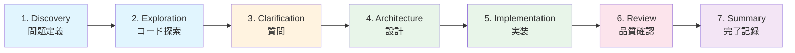
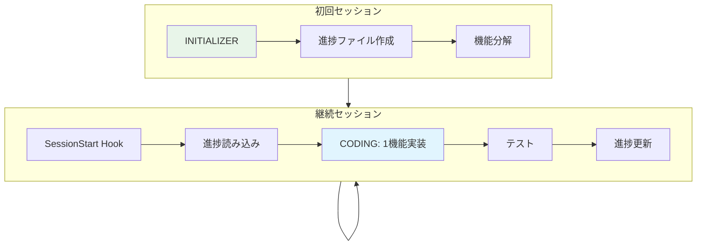
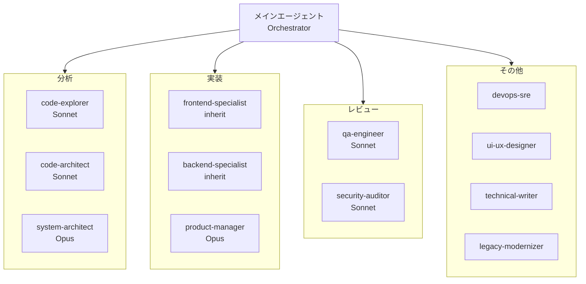

# SDD Toolkit v9.0.0

**Claude Code 向け仕様駆動開発ツールキット**

Anthropic の 6 つの Composable パターンをすべて実装した、長時間自律作業のためのエージェントフレームワーク。

---

## このプラグインの目的

| 目標 | 実現方法 |
|------|----------|
| **長時間の自律作業** | Initializer + Coding パターン、JSON 進捗ファイル、SessionStart フック |
| **徹底したスペック駆動** | 7フェーズワークフロー、No Code Without Spec、`/spec-review` |
| **サブエージェントへの移譲** | 12専門エージェント、コンテキスト保護、結果サマリーのみ返却 |
| **ユーザーへの十分な質問** | Phase 3: Clarifying Questions、AskUserQuestion ツール、信頼度 80% 閾値 |

---

## クイックスタート

### インストール

```bash
# プラグインディレクトリからインストール
/plugin install sdd-toolkit@your-marketplace

# または開発用にローカルロード
claude --plugin-dir /path/to/sdd-toolkit
```

### 基本的な使い方

```bash
# 複雑な機能開発（7フェーズワークフロー）
/sdd ユーザー認証機能を OAuth 対応で実装

# 仕様のレビュー
/spec-review docs/specs/user-auth.md

# コードレビュー（並列エージェント、信頼度 >= 80）
/code-review staged

# 小規模タスクの高速実装
/quick-impl README のタイポを修正
```

### 使用パターン

| シナリオ | コマンド | 説明 |
|----------|----------|------|
| 新機能開発 | `/sdd` | 7フェーズで徹底的に設計・実装 |
| バグ修正 | `/sdd` または `/quick-impl` | 複雑さに応じて選択 |
| リファクタリング | `/sdd` | 探索→設計→実装で安全に変更 |
| コードレビュー | `/code-review staged` | コミット前に並列レビュー |
| 仕様確認 | `/spec-review` | 実装前に仕様の妥当性を検証 |

---

## 7フェーズ SDD ワークフロー

`/sdd` コマンドは包括的な開発ワークフローを実行します:



| フェーズ | 目的 | 実行内容 |
|----------|------|----------|
| 1. Discovery | 構築内容の理解 | 問題定義、制約特定、ユーザー確認 |
| 2. Codebase Exploration | 既存コードの把握 | 2-3 の `code-explorer` エージェントを並列実行 |
| 3. Clarifying Questions | 曖昧さの解消 | エッジケース、エラー処理、統合ポイントを確認 |
| 4. Architecture Design | 設計決定 | 2-3 の `code-architect` エージェントで分析し、統合推奨 |
| 5. Implementation | 機能構築 | 専門エージェントに移譲、1 機能ずつ実装 |
| 6. Quality Review | 品質確保 | qa-engineer、security-auditor、code-explorer を並列実行 |
| 7. Summary | 完了記録 | 変更内容、決定事項、次のステップを文書化 |

---

## 主要コンセプト

### Anthropic の 6 Composable パターン

このプラグインは [Building Effective Agents](https://www.anthropic.com/engineering/building-effective-agents) で定義された全 6 パターンを実装しています：

| パターン | このプラグインでの実装 |
|----------|------------------------|
| **Prompt Chaining** | 7フェーズ SDD ワークフロー、TDD Red-Green-Refactor サイクル |
| **Routing** | モデル選択（Opus/Sonnet/Haiku）、ドメイン別エージェント選択 |
| **Parallelization** | 複数 code-explorer の同時実行、並列レビューワー |
| **Orchestrator-Workers** | メインエージェントが 12 の専門サブエージェントを調整 |
| **Evaluator-Optimizer** | 品質レビューでの反復ループ（信頼度 >= 80 まで改善） |
| **Augmented LLM** | ツール + 進捗ファイル（メモリ）+ 検索 |

詳細は `skills/core/composable-patterns/SKILL.md` を参照。

### 長時間作業サポート

[Effective Harnesses for Long-Running Agents](https://www.anthropic.com/engineering/effective-harnesses-for-long-running-agents) に基づく設計:



| ロール | タイミング | 実行内容 |
|--------|------------|----------|
| **INITIALIZER** | 初回セッション | 進捗ファイル作成、機能分解、状態初期化 |
| **CODING** | 各セッション | 進捗読み込み、1 機能実装、テスト、進捗更新 |

#### 進捗ファイル

```
.claude/
├── claude-progress.json    # 進捗ログと再開コンテキスト
└── feature-list.json       # 機能/タスクのステータス追跡
```

<details>
<summary>claude-progress.json の例</summary>

```json
{
  "project": "feature-name",
  "status": "in_progress",
  "currentTask": "認証サービスの実装",
  "resumptionContext": {
    "position": "Phase 5 - Implementation",
    "nextAction": "src/services/auth.ts に AuthService を作成",
    "blockers": []
  }
}
```
</details>

<details>
<summary>feature-list.json の例</summary>

```json
{
  "features": [
    {"id": "F001", "name": "ユーザー登録", "status": "completed"},
    {"id": "F002", "name": "ユーザーログイン", "status": "in_progress"},
    {"id": "F003", "name": "パスワードリセット", "status": "pending"}
  ]
}
```
</details>

> **なぜ JSON か？** 「モデルは Markdown ファイルと比較して JSON ファイルを不適切に変更する可能性が低い」- Anthropic

---

## エージェント一覧



### コア分析エージェント

| エージェント | モデル | 用途 |
|--------------|--------|------|
| `code-explorer` | Sonnet | 深いコードベース分析、`file:line` 参照で実行フロー追跡 |
| `code-architect` | Sonnet | 既存パターンに基づく機能設計ブループリント |
| `system-architect` | **Opus** | システムレベル設計、ADR、API コントラクト（深い推論が必要） |

### 実装エージェント

| エージェント | モデル | 用途 |
|--------------|--------|------|
| `frontend-specialist` | **inherit** | UI 実装（ユーザーのセッションモデルを使用） |
| `backend-specialist` | **inherit** | API 実装（ユーザーのセッションモデルを使用） |
| `product-manager` | **Opus** | 要件収集、PRD 作成（曖昧な要件から本質を抽出） |

### レビューエージェント

| エージェント | モデル | 用途 |
|--------------|--------|------|
| `qa-engineer` | Sonnet | テスト戦略、カバレッジ分析（信頼度 >= 80） |
| `security-auditor` | Sonnet | OWASP Top 10、脆弱性レビュー（読み取り専用） |

### その他の専門エージェント

| エージェント | モデル | 用途 |
|--------------|--------|------|
| `devops-sre` | Sonnet | インフラ、CI/CD、デプロイメント |
| `ui-ux-designer` | Sonnet | デザインシステム、アクセシビリティ |
| `technical-writer` | Sonnet | ドキュメント、変更履歴 |
| `legacy-modernizer` | Sonnet | 安全なリファクタリング、特性テスト |

### モデル選択戦略

| モデル | 使用場面 | 理由 |
|--------|----------|------|
| **Opus** | system-architect, product-manager | ADR やシステム設計、曖昧な要件の本質抽出は深い推論が必要 |
| **Sonnet** | 分析・レビュー系 | バランスの取れたコスト/能力 |
| **Haiku** | 組み込み Explore、スコアリング | 高速で軽量な探索 |
| **inherit** | 実装系 | ユーザーがコスト/品質のトレードオフを制御 |

---

## コマンド

| コマンド | 用途 | 使用場面 |
|----------|------|----------|
| `/sdd` | 7フェーズワークフロー | 新機能、複雑な変更 |
| `/spec-review` | 仕様検証 | 実装前の仕様確認 |
| `/code-review` | コードレビュー | コミット前（並列エージェント） |
| `/quick-impl` | 高速実装 | 明確な小規模タスク |

---

## スキル

### コアスキル

| スキル | 用途 |
|--------|------|
| `composable-patterns` | **Anthropic の 6 パターン**（Prompt Chaining、Routing、Parallelization、Orchestrator-Workers、Evaluator-Optimizer、Augmented LLM） |
| `context-engineering` | **コンテキスト管理**（Context Rot 防止、Progressive Disclosure、サブエージェント分離） |
| `subagent-contract` | **標準化された結果フォーマット**（全エージェントが参照） |
| `sdd-philosophy` | 仕様駆動開発の原則 |
| `security-fundamentals` | セキュリティベストプラクティス（OWASP、秘密情報） |
| `interview` | 構造化された要件収集 |
| `stack-detector` | プロジェクト技術スタックの自動検出 |

### ワークフロースキル

| スキル | 用途 |
|--------|------|
| `tdd-workflow` | **テスト駆動開発**（Red-Green-Refactor サイクル） |
| `evaluator-optimizer` | **反復的品質改善**（Generator-Evaluator ループ） |
| `error-recovery` | **チェックポイントと回復**（graceful degradation） |
| `progress-tracking` | JSON ベースの状態永続化 |
| `parallel-execution` | マルチエージェント調整 |
| `long-running-tasks` | 状態永続化、セッション再開 |
| `code-quality` | プロジェクト設定された品質ツールを検出・実行 |
| `git-mastery` | Conventional Commits、変更履歴 |
| `testing` | テストピラミッド、戦略、フレームワーク |
| `api-design` | API 仕様パターン |
| `migration` | コードマイグレーション戦略 |
| `observability` | モニタリングとロギング |

---

## フック

| フック | イベント | 用途 |
|--------|---------|------|
| `sdd_context.sh` | SessionStart | SDD コンテキスト注入、**進捗ファイル検出**、再開サポート |
| `subagent_init.sh` | SubagentStart | サブエージェント初期化、ロール別コンテキスト |
| `safety_check.py` | PreToolUse (Bash) | 危険なコマンドをブロック |
| `prevent_secret_leak.py` | PreToolUse (Write/Edit) | 秘密情報の検出 |
| `pre_compact_save.sh` | PreCompact | **コンパクション前の状態保存**（長時間セッション対応） |
| `subagent_summary.sh` | SubagentStop | 完了ログ記録 |
| `session_summary.sh` | Stop | git status サマリー |

---

## ベストプラクティス

### 推奨

- 複雑な作業は `/sdd` で開始
- 探索作業は積極的にサブエージェント（特に `code-explorer`）に移譲
- 主要タスク間で `/clear` を使用
- コードより先に仕様を書く
- コミット前に `/code-review` を実行
- 長時間タスクには JSON 進捗追跡を使用
- 信頼度 >= 80 のエージェント出力を信頼

### 非推奨

- 探索フェーズのスキップ
- メインスレッドでのコンテキスト蓄積
- 秘密情報のハードコード
- security-auditor の指摘を無視
- 信頼度 < 80 の問題を報告

---

## 公式ベストプラクティスとの関係

> このプラグインは公式プラグインを模倣するのではなく、その**考え方を活用**して独自の目的を達成します。

| 公式の考え方 | このプラグインでの活用 |
|--------------|------------------------|
| サブエージェントによるコンテキスト管理 | 12の専門エージェントで徹底移譲 |
| 信頼度ベースのフィルタリング (80%) | 全レビューに統一適用 |
| Initializer + Coding パターン | SessionStart で自動ロール検出 |
| One Feature at a Time | 進捗ファイルで 1 機能ずつ追跡 |

### 意図的な差異

| 公式 `feature-dev` | このプラグイン | 理由 |
|--------------------|----------------|------|
| 3つのアプローチを提示 | **単一の決定的推奨** | 決定疲れを軽減、code-architect が内部で代替案を検討済み |
| `claude-progress.txt` (テキスト) | `claude-progress.json` (JSON) | 機械可読で誤変更されにくい |
| 汎用エクスプローラー | **12の専門エージェント** | ドメイン専門性で品質向上 |

---

## プラグイン構造

```
sdd-toolkit/
├── .claude-plugin/
│   └── plugin.json           # プラグインメタデータ (v9.0.0)
├── commands/                  # ワークフローコマンド
│   ├── sdd.md                # 7フェーズワークフロー
│   ├── spec-review.md        # 仕様レビュー
│   ├── code-review.md        # コードレビュー（信頼度 >= 80）
│   └── quick-impl.md         # 高速実装
├── agents/                    # 12の専門エージェント
│   ├── code-explorer.md      # 深いコードベース分析（読み取り専用）
│   ├── code-architect.md     # 機能設計ブループリント
│   ├── system-architect.md   # システム設計（Opus）
│   ├── frontend-specialist.md
│   ├── backend-specialist.md
│   ├── qa-engineer.md
│   ├── security-auditor.md
│   └── ...
├── skills/                    # タスク指向スキル
│   ├── core/                  # 普遍的原則
│   │   ├── composable-patterns/  # Anthropic の 6 パターン
│   │   ├── context-engineering/  # コンテキスト管理（Context Rot 防止）
│   │   ├── subagent-contract/    # 標準化された結果フォーマット
│   │   ├── sdd-philosophy/
│   │   └── ...
│   ├── detection/             # スタック検出
│   └── workflows/             # クロススタックワークフロー
│       ├── tdd-workflow/         # テスト駆動開発
│       ├── evaluator-optimizer/  # 反復的品質改善
│       ├── error-recovery/       # チェックポイントと回復
│       └── ...
├── hooks/                     # 実行フック
│   ├── hooks.json
│   ├── sdd_context.sh        # SessionStart
│   └── ...
└── docs/
    └── specs/
        └── SPEC-TEMPLATE.md
```

---

## カスタマイズ

### 新しいコマンドの追加

`commands/my-command.md` を YAML フロントマターで作成。

### 新しいエージェントの追加

`agents/my-agent.md` を作成。`description`、`model`、`tools`、`skills` を含む YAML フロントマターが必要。

### 新しいスキルの追加

`skills/category/my-skill/SKILL.md` を YAML フロントマターで作成。

詳細なテンプレートは `CLAUDE.md` を参照。

---

## 参照資料

### 公式ガイドライン

- [Building Effective Agents](https://www.anthropic.com/engineering/building-effective-agents) - 6 Composable パターン
- [Effective Context Engineering for AI Agents](https://www.anthropic.com/engineering/effective-context-engineering-for-ai-agents) - コンテキスト管理
- [Claude Code Best Practices](https://www.anthropic.com/engineering/claude-code-best-practices)
- [Effective Harnesses for Long-Running Agents](https://www.anthropic.com/engineering/effective-harnesses-for-long-running-agents)
- [Multi-Agent Research System](https://www.anthropic.com/engineering/multi-agent-research-system) - Orchestrator-Workers
- [Equipping Agents for the Real World with Agent Skills](https://www.anthropic.com/engineering/equipping-agents-for-the-real-world-with-agent-skills)

### Claude Code 仕様

- [Subagent Documentation](https://code.claude.com/docs/en/sub-agents)
- [Agent Skills](https://code.claude.com/docs/en/skills) - Progressive Disclosure
- [Hooks Reference](https://code.claude.com/docs/en/hooks) - フック仕様

### 実装例

- [Anthropic Cookbook - Agent Patterns](https://github.com/anthropics/anthropic-cookbook/tree/main/patterns/agents)

---

## ライセンス

MIT
