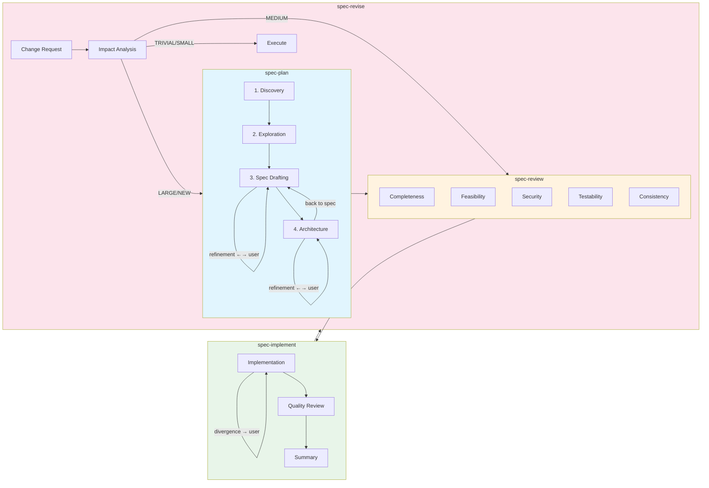

# Spec-Workflow Toolkit

**Claude Code 向け仕様駆動開発ツールキット**

複雑な機能開発を、専門AIエージェントの支援を受けながら段階的に進めるプラグインです。
各段階で確認・判断でき、中断した作業も途中から再開できます。

---

## クイックスタート

### インストール

```bash
git clone https://github.com/MysMon/Spec-Workflow-Toolkit.git spec-workflow-toolkit
claude --plugin-dir ./spec-workflow-toolkit
```

> 既存プロジェクト内に配置する場合は `.plugins/spec-workflow-toolkit` などにクローンしてください。

### 基本ワークフロー

```bash
# 1. 仕様と設計を作成
/spec-workflow-toolkit:spec-plan OAuth対応のユーザー認証機能を実装したい

# 2. 仕様をレビューして修正（spec-planが出力したファイルを指定）
/spec-workflow-toolkit:spec-review docs/specs/user-authentication.md

# 3. 承認済みの仕様に基づいて実装
/spec-workflow-toolkit:spec-implement docs/specs/user-authentication.md
```

### その他のコマンド

```bash
# 仕様書なしで小規模タスクを実装
/spec-workflow-toolkit:quick-impl READMEのタイポを修正

# 中断した作業を再開
/spec-workflow-toolkit:resume
```

---

## コマンド一覧

### 計画・実装

| コマンド | 説明 |
|----------|------|
| `/spec-workflow-toolkit:spec-plan` | 新機能の仕様と設計を対話的に作成 |
| `/spec-workflow-toolkit:spec-review` | 仕様・設計をレビューし修正 |
| `/spec-workflow-toolkit:spec-implement` | 承認済みの仕様に基づいて実装 |
| `/spec-workflow-toolkit:spec-revise` | 実装後の変更・追加依頼に対応 |
| `/spec-workflow-toolkit:quick-impl` | 小規模タスクを迅速に実装（仕様書不要） |

### レビュー

| コマンド | 説明 |
|----------|------|
| `/spec-workflow-toolkit:code-review` | コミット前にコードの品質をチェック |
| `/spec-workflow-toolkit:review-response` | PR レビューのコメントに対応 |
| `/spec-workflow-toolkit:review-insights` | 開発中に記録された知見を評価・反映 |

### トラブルシューティング

| コマンド | 説明 |
|----------|------|
| `/spec-workflow-toolkit:debug` | エラーを段階的に分析し根本原因を特定 |
| `/spec-workflow-toolkit:ci-fix` | CI/CD パイプラインの失敗を診断・修正 |
| `/spec-workflow-toolkit:hotfix` | 本番環境の障害を迅速に修正 |
| `/spec-workflow-toolkit:merge-conflict` | マージ時の競合を解決 |

### セットアップ・管理

| コマンド | 説明 |
|----------|------|
| `/spec-workflow-toolkit:project-setup` | プロジェクト固有の開発ルールを自動生成 |
| `/spec-workflow-toolkit:stack-consult` | 新規プロジェクトの技術スタックを選定 |
| `/spec-workflow-toolkit:resume` | 中断したセッションを進捗ファイルから再開 |
| `/spec-workflow-toolkit:doc-audit` | コードとドキュメントの整合性を検証 |

---

## 計画 → レビュー → 実装 → 改訂

複雑な機能開発を4つのフェーズに分けて進めます。

**フェーズを分離する理由**
- 各フェーズで AI のコンテキストを最大限活用できる
- 計画後にレビューを挟むことで手戻りを減らせる
- 各フェーズでユーザーと対話しながら改善できる
- 長時間の作業でも途中で中断・再開できる



> **Note**: コマンドは `spec-workflow-toolkit:` プレフィックス付きで実行します（例: `/spec-workflow-toolkit:spec-plan`）

| フェーズ | コマンド | ユーザーがやること | 出力 |
|----------|----------|---------------------|------|
| 計画 | `spec-workflow-toolkit:spec-plan` | 要件を説明し、仕様・設計の修正を依頼 | 仕様書 + 設計書 |
| レビュー | `spec-workflow-toolkit:spec-review` | 指摘事項を確認し、必要に応じて修正を指示 | レビューレポート |
| 実装 | `spec-workflow-toolkit:spec-implement` | 進捗を確認し、仕様とのずれがあれば判断 | 動作するコード |
| 改訂 | `spec-workflow-toolkit:spec-revise` | 変更内容を説明し、影響度に応じた対応を選択 | 更新された仕様・設計

---

## セッション再開

Claude Code では 2 つの再開方法があります。

| 方法 | コマンド | 用途 |
|------|----------|------|
| **Claude Code 標準** | `claude --continue` | 直前のセッションをそのまま継続 |
| **Spec-Workflow Toolkit** | `/spec-workflow-toolkit:resume` | 進捗ファイルから状態を復元 |

| シナリオ | 推奨 |
|----------|------|
| ネットワーク切断後すぐに再接続 | `--continue` |
| 翌日に作業を再開 | `/spec-workflow-toolkit:resume` |
| 別のターミナルで作業継続 | `/spec-workflow-toolkit:resume` |
| コンテキスト肥大化時 | `/spec-workflow-toolkit:resume` |

---

## 開発インサイトの記録

開発中に発見したパターンや決定事項を自動記録し、プロジェクトルールに反映できます。

- サブエージェントが発見した内容を自動キャプチャ
- `/spec-workflow-toolkit:review-insights` で一つずつ評価し、CLAUDE.md や `.claude/rules/` に反映
- セッション開始時に未評価のインサイトがあれば通知

---

## ベストプラクティス

| 推奨 | 理由 |
|------|------|
| 複雑な作業は `/spec-workflow-toolkit:spec-plan` で計画から開始 | 仕様を明確にしてから実装することで手戻りを防ぐ |
| コードベース調査は `code-explorer` エージェントに任せる | メインセッションのコンテキストを節約できる |
| コードより先に仕様を書く | 要件の曖昧さを実装前に解消できる |
| コミット前に `/spec-workflow-toolkit:code-review` を実行 | 品質問題を早期に発見できる |

| 避けるべきこと | 理由 |
|----------------|------|
| コードベースを理解せずに実装を始める | 既存設計との不整合が発生しやすい |
| 全機能を一度に実装しようとする | デバッグが困難になり、品質が低下する |
| 秘密情報をコードにハードコード | リポジトリ公開時に漏洩するリスクがある |
| `security-auditor` エージェントの指摘を無視 | セキュリティ脆弱性が本番環境に混入する |

---

## プロジェクト固有ルール

Spec-Workflow Toolkit は汎用ワークフローを提供します。プロジェクト固有のルールは `.claude/rules/` で管理できます。

```bash
# プロジェクト固有ルールを自動生成
/spec-workflow-toolkit:project-setup
```

詳細: [Manage Claude's memory](https://code.claude.com/docs/en/memory)

---

## エージェント一覧

### 分析・計画

| エージェント | 説明 |
|--------------|------|
| `code-explorer` | コードベースを調査（読み取り専用） |
| `code-architect` | 機能の設計書を作成 |
| `system-architect` | システム全体の設計、設計決定の記録 |
| `product-manager` | 要件を収集し、仕様書（PRD）を作成 |

### 実装

| エージェント | 説明 |
|--------------|------|
| `frontend-specialist` | UI・フロントエンドを実装 |
| `backend-specialist` | API・バックエンドを実装 |
| `ui-ux-designer` | デザインシステム、UI設計を担当 |

### レビュー・検証

| エージェント | 説明 |
|--------------|------|
| `qa-engineer` | テスト戦略を立案し、カバレッジを分析 |
| `security-auditor` | セキュリティ脆弱性をレビュー |
| `verification-specialist` | 事実確認、参照の検証を実施 |

### 運用・保守

| エージェント | 説明 |
|--------------|------|
| `devops-sre` | インフラ構築、CI/CD パイプラインを管理 |
| `technical-writer` | ドキュメントを作成・更新 |
| `legacy-modernizer` | レガシーコードを安全にリファクタリング |

---

## 動作要件

### 必須

- Claude Code 1.0.33 以降

### 推奨

- Python 3.x（インサイト記録・参照検証機能に必要）

Python がない環境でもプラグインは動作しますが、以下の機能が無効になります：
- サブエージェント終了時のインサイト自動キャプチャ
- ファイル参照の自動検証

### セキュリティに関する注意

このプラグインは `PreToolUse` フックで Bash コマンドを検証し、危険なコマンドをブロックします。安全と判断されたコマンドは自動承認されるため、通常の許可プロンプトがスキップされます。

自動承認の対象外にしたい場合は、`hooks/safety_check.py` の `permissionDecision` を `"ask"` に変更してください。

---

## 参照資料

| 記事 | 内容 |
|------|------|
| [Building Effective Agents](https://www.anthropic.com/engineering/building-effective-agents) | エージェント設計パターン |
| [Effective Harnesses for Long-Running Agents](https://www.anthropic.com/engineering/effective-harnesses-for-long-running-agents) | 長時間作業のハーネス設計 |
| [Claude Code Best Practices](https://www.anthropic.com/engineering/claude-code-best-practices) | コンテキスト管理 |

---

## 開発者向け

このプラグインを拡張・修正する場合は `docs/DEVELOPMENT.md` を参照してください。

---

## ライセンス

MIT
